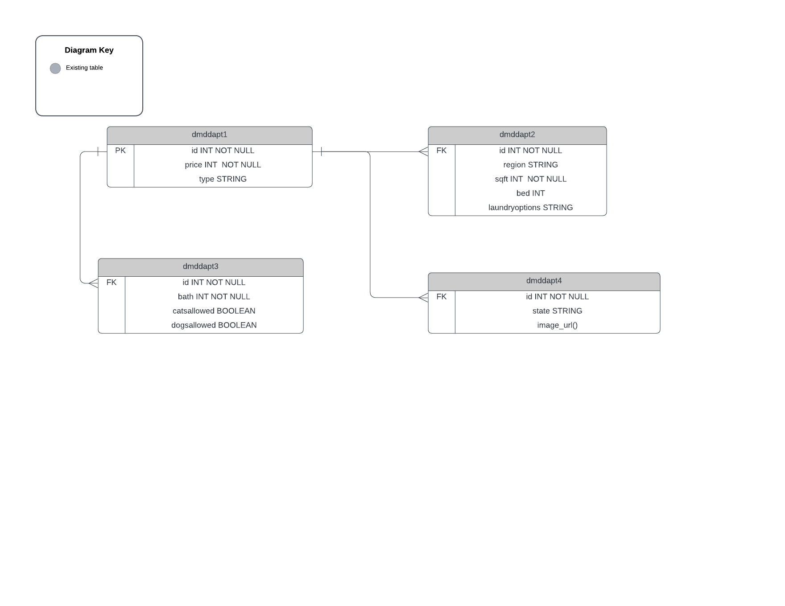

# NUID:
- Hardik Sodhani : 002770306
- Rucha Chotalia : 002711888
- Aakash Rajawat : 002764127
- Diya Baldota   : 002747966

# Apartment Rental System
The goal of our project is to make a unified solution for people to find and book the best rental apartments according to their set of preferences with filters that allow them to look for the distance to their universities or workplace, their preferred locality and also fit in their budget, in and around Boston.

## The steps and requirements for our project:
+ To gather the data of approximately 800+ apartments in the vicinity of Boston.
+ Data Preprocessing for removing the redundancies in the collected data.
+ To generate an optimal system that provides the user the best suitable apartment options for their set preferences. 

## The features of our dataset:
    1. Sr no
	2. Apt no, Floor
	3. Rent
	4. Locality
	5. Square ft. area
	6. Number of Rooms and Bath
	7. Furnished (y/n)
	8. Parking (y/n)
	9. Pets allowed (y/n) 
	10. Utilities(electricity, gas, trash, hot water) 
	11. Distance from University and schools		
	12. Type of Apartment
	13. Security type
	14. Number of people on lease
	15. Laundry in unit or in basement
	16. Lease start or end date
	17. Availability(y/n)
	18. Transportation

# Normalisation techniques using 1NF, 2NF, 3NF:

Normalisation techniques on SQL Databases in python programming language to check whether the table is in 1NF, 2NF or in 3NF.

### User Table:

CREATE TABLE `User` (
  `User_id` VARCHAR(10),
  `name` VARCHAR(20),
  `description` VARCHAR(100),
  `followers_count` INT,
  `following_count` INT,
   PRIMARY KEY  (`User_id`)
);

### Tweets Table:

CREATE TABLE `Tweets` (
  `tweet_id` INT NOT NULL AUTO_INCREMENT,
  `Twitter_handle` VARCHAR(10),
  `tweet_text` VARCHAR(140),
  `created_at` DATETIME,
   PRIMARY KEY  (`tweet_id`)
);

### Tweet_Url Table:

CREATE TABLE `Tweet_Url` (
  `tweet_id` INT NOT NULL,
  ‘rental_id’ INT NOT NULL,
  PRIMARY KEY  (`rental_id`)
);

### User_Account Table:

CREATE TABLE `User_Account` (
  ‘User_acc’ INT NOT NULL
  `Twitter_handle` VARCHAR(10) NOT NULL,
  `profile_image_url` VARCHAR(10),
  `password` VARCHAR(10),
   PRIMARY KEY  (`Twitter_handle`)
);

### Follower_count Table:

CREATE TABLE `Follower_count` (
  ‘rental_id’ INT NOT NULL,
  `created_at` DATETIME,
  ‘followers_count’’ INT,
  PRIMARY KEY  (`‘rental_id’`)
);

CREATE TABLE `Boston Rentals` ( 
  ‘rental_id’ INT NOT NULL,
  rental_location` VARCHAR(10),
  rental_text` VARCHAR(10) 
  `created_at` DATETIME,
  ‘followers_count’’ INT,
  PRIMARY KEY  (`‘rental_id’`)
);

CREATE TABLE `Tweet_df` ( 
  ‘rental_id’ INT NOT NULL,
  `created_at` DATETIME,
   rental_text` VARCHAR(10)
   PRIMARY KEY  (`‘rental_id’`)
);

## Explaination on some of the design decisions:

- ‘BostonRentals’ table has everything that is posted on the twitter platform with the keyword that the user inputs and has properties 
   like (created_at, id, text, media, location), all the new tweets can be scraped and added to this table using the scripting from keyword 
   using Twitter API v2.
- ‘BostonFollow’ table has the count of followers the user has gained per tweet. This table can be altered as and when there 
  is new tweet posted by the user.
- 'Tweets_df’ table shows the last 50 tweets of the set username. It has attributed such as created_at, id, text which can be scraped
   using the username of a user, in this case ‘Apartments Boston’.
   

   
## SQL STATEMENTS:

### Use case: User searches for rentals in Boston:
SELECT * from bostonrentals where location="Boston, MA";

### Use case: Search on twitter with a specific price range:
SELECT * from bostonrentals where Text like '%3,000%'

### Use case: Search on twitter with a specific house type:
SELECT * FROM bostonrentals WHERE Text like '%5 Bedrooms 2 Baths%'

### Use case: Search on twitter with a specific area of preference:
SELECT * FROM bostonrentals ORDER BY Location ASC

### Use case: User is redirected to their specific search:
SELECT *
FROM bostonrentals
WHERE NOT (Text LIKE '%RT%');

# USE CASES:

### Use Case 1:
SELECT dmddapt1.id, dmddapt2.beds, dmddapt2.sqfeet 
FROM dmddapt1
INNER JOIN dmddapt2 ON dmddapt1.id=dmddapt2.id;

### Use Case 2:
SELECT dmddapt1.id, dmddapt2.beds, dmddapt2.laundry_options 
FROM dmddapt1
LEFT JOIN dmddapt2 ON dmddapt1.id=dmddapt2.id;

### Use Case 3:
SELECT dmddapt1.id, dmddapt2.region, dmddapt2.sqfeet
FROM dmddapt2
RIGHT JOIN dmddapt1 ON dmddapt1.id=dmddapt2.id ;

### Use Case 4:
SELECT dmddapt1.id, dmddapt2.region, dmddapt2.sqfeet
FROM dmddapt2
INNER JOIN dmddapt1 ON dmddapt1.id=dmddapt2.id 
ORDER BY dmddapt2.sqfeet DESC;

### Use Case 5:
SELECT dmddapt1.type,  dmddapt2.sqfeet
FROM dmddapt2
INNER JOIN dmddapt1 ON dmddapt1.id=dmddapt2.id ;

### Use Case 6:
SELECT AVG(dmddapt1.price)
FROM dmddapt2
INNER JOIN dmddapt1 ON dmddapt1.id=dmddapt2.id ;

### Use Case 7:
SELECT state, count(image_url) as count
FROM dmddapt4
GROUP BY state;

### Use Case 8:
SELECT COUNT(id) as count, region
FROM dmddapt2
GROUP BY region;

### Use Case 9:
SELECT dmddapt1.id, dmddapt2.beds, dmddapt2.sqfeet 
FROM dmddapt1
INNER JOIN dmddapt2 ON dmddapt1.id=dmddapt2.id
where dmddapt2.laundry_options like '%laundry in bldg%' or dmddapt2.laundry_options like '%laundry on site%';

### Use Case 10:
SELECT dmddapt1.id, dmddapt1.price, dmddapt1.type, dmddapt2.region 
FROM dmddapt1
INNER JOIN dmddapt2 ON dmddapt1.id=dmddapt2.id
where dmddapt2.region = 'Boston' and dmddapt1.type like '%apartment%';

### Use Case 11:
SELECT *
FROM dmddapt2
JOIN dmddapt3 ON dmddapt2.id=dmddapt3.id
where dmddapt2.region='Boston' and dmddapt3.cats_allowed=1  ;

### Use Case 12:
SELECT *
FROM dmddapt1
JOIN dmddapt4 ON dmddapt1.id=dmddapt4.id
where dmddapt1.type = 'apartment' and dmddapt4.image_url IS NOT NULL;

### Use Case 13:
SELECT dmddapt1.id, dmddapt1.price, dmddapt1.type, dmddapt2.region 
FROM dmddapt1
JOIN dmddapt2 ON dmddapt1.id=dmddapt2.id
where dmddapt2.region = 'Boston' and dmddapt1.type like '%apartment%';

### Use Case 14:
SELECT dmddapt1.id, dmddapt1.price, dmddapt2.region 
FROM dmddapt1
JOIN dmddapt2 ON dmddapt1.id=dmddapt2.id
where dmddapt2.sqfeet > 700 and dmddapt1.type like '%apartment%'
ORDER BY dmddapt1.price DESC;

### Use Case 16:
SELECT dmddapt1.id, dmddapt1.price, dmddapt2.beds,dmddapt2.laundry_options 
FROM dmddapt1
JOIN dmddapt2 ON dmddapt1.id=dmddapt2.id
where dmddapt2.laundry_options='w/d in unit';

### Use Case 17:
SELECT dmddapt1.id, dmddapt1.price, dmddapt2.beds,dmddapt2.beds 
FROM dmddapt1
JOIN dmddapt2 ON dmddapt1.id=dmddapt2.id
where dmddapt2.beds>1;

### Use Case 16:
SELECT DISTINCT dmddapt2.region, dmddapt2.sqfeet
FROM dmddapt2
RIGHT JOIN dmddapt1 ON dmddapt1.id=dmddapt2.id ;

### Use Case 18:
SELECT dmddapt1.id, dmddapt3.cats_allowed, dmddapt3.cats_allowed
FROM dmddapt3
RIGHT JOIN dmddapt1 ON dmddapt1.id=dmddapt3.id ;

### Use Case 19:
SELECT * FROM dmddapt1 
where price>100 
order by price desc;

### Use Case 20:
Select * from dmddapt2
where beds >= 2 and laundry_options = 'w/d in unit'

## ER Diagram:
 

  

